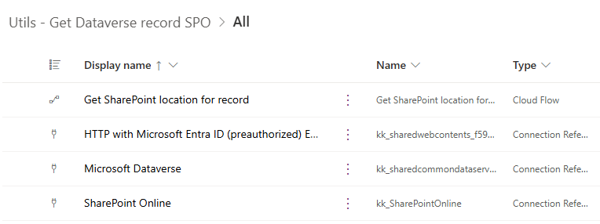
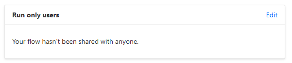

# Get SharePoint location for Dataverse record

SharePoint document management for Dataverse offers numerous [advantages](https://ludovicperrichon.com/synchronise-documents-in-between-dataverse-and-sharepoint). And while accessing documents and their locations via a model-driven Power Platform app is straightforward, retrieving them using Power Automate can be quite challenging.

If you need to archive attached documents in a different location or send them all via email as attachments, you must first locate the SharePoint Online (SPO) library and folder associated with the entity.

Get SharePoint location for record

The "Get SharePoint location for record" flow utilizes the Document Location Dataverse table to gather details about the attachment location, such as the folder name and sharepointdocumentlocationid. It then calls the RetrieveAbsoluteAndSiteCollectionUrl() Dataverse function to obtain the SharePoint Online site collection URL. For a more comprehensive explanation of these concepts, refer to the article: [Power Automate Get absolute Sharepoint URL from document location](https://crmaddicted.blogspot.com/2020/03/power-automate-get-absolute-sharepoint.html).

The flow then executes a series of SharePoint REST api calls  to obtain a full set of information, like

| parameter name | description | example |
|-|-|-|
| `tenant_name` | the URL of the tenant's root site; also used as a hostname when retrieving SPO site [using GUID](https://learn.microsoft.com/en-us/graph/api/site-get?view=graph-rest-1.0&tabs=http#example-1-get-a-site-using-the-site-id).  | `contoso.sharepoint.com` |
| `site_url` | The URL of the current SharePoint site, as defined in the `site URL` parameter.  | `https://contoso.sharepoint.com/sites/XYZ` |
| `site_title` | Title of the current SPO site | `Project XYZ` |
| `site_id` | The `id` of the current SPO site in a `guid` format. | `xxxxxxxx-xxxx-xxxx-xxxx-xxxxxxxxxxxx` |
| `web_id` | The `id` of the current SPO web object in a `guid` format. | `yyyyyyyy-yyyy-yyyy-yyyy-yyyyyyyyyyyy` |
| `library_absolute_url` | The full URL of the library. | `https://contoso.sharepoint.com/sites/XYZ/idapps_externalcloudservice` |
| `library_name` | The `RootFolder`. Used in the URL, is generated automatically and cannot be changed by users. It can be changed with PowerShell.| `idapps_externalcloudservice` |
| `library_title` | The title of the library. This property can be changed by the user. | `The Archive Library` |
| `library_id` | Library's id in a `guid` format | `zzzzzzzz-zzzz-zzzz-zzzz-zzzzzzzzzzzz` |
| `library_drive_id` | Used by Graph API when referencing libraries. | `b!S3SdNSBmTUGa4v5ffh_rslLJssoXH4xEuShkEO-uxKg9bblUMeoaTbQC5t69DJ-x` |
| `folder_absolute_url`  | absolute url of a SPO library folder associated with the current teams channel | `https://contoso.sharepoint.com/sites/XYZ/idapps_externalcloudservice/test01_5437302CBC7A4D96AFD9BDFDAF15EF7F`|
| `folder_display_name`  | display name of the folder; white spaces are not encoded | `test01_5437302CBC7A4D96AFD9BDFDAF15EF7F`|
| `folder_drive_id`      | `driveItem Id` for the folder. Can be used in MS Graph API [Get driveItem](https://learn.microsoft.com/en-us/graph/api/driveitem-get)  |  `01JEVXUVBDVF6ZMUFRM5B34EGLOEDAUF5B`|
| `folder_id`            | SPO list item id. Can be used in SharePoint REST API, or MS Graph API [Get listItem](https://learn.microsoft.com/en-us/graph/api/listitem-get) | `15`|
| `error_message` | The error message if any of the actions failed, or empty string. | `{"Error":"..."}`   |
| `success` | | `True` or `False` |

## Solution components

The solution consists of:

- **Get SharePoint location for record** flow
- the following connection references:
    - **HTTP with Microsoft Entra ID (preauthorized) ExternalCloudService-f5993**
    - **Microsoft Dataverse**
    - **SharePoint Online**

    

## Installation

1. To use the workflow, import either **managed or unmanaged solution** available under [Releases](https://github.com/kkazala/Power-Automate-Utils/releases). If you want to be able to edit the flow, choose **unmanaged**:

1. When importing a solution, you will need to provide a connection reference to your Power Platform Environment. Ensure that the connection is created using the URL of your Power Platform Environment.

    

    The value of "URL of the request"  does not include a host name. The request URL will be created by combining the URL specified in the referenced connection with the API endpoint defined in the "URL of the request" field.

    

1. After the solution is imported, configure the **Get SharePoint location for record** cloud flow, to be executed as a child flow. Configure the `run only` permissions, using the flow owner’s embedded connection:

   

    Click on **Edit** link and change the connection in the **Connections Used** section

    

1. Add a [service principal](https://learn.microsoft.com/en-us/power-automate/service-principal-support) as an additional owner to ensure business continuity.

