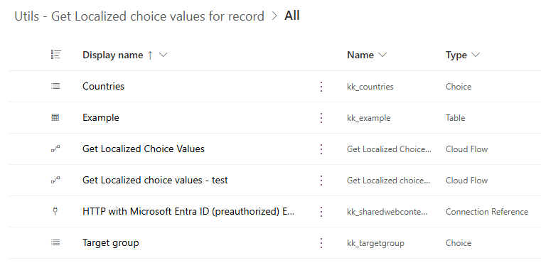
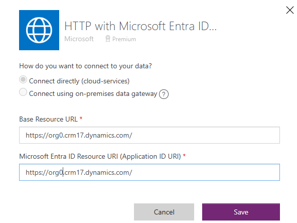
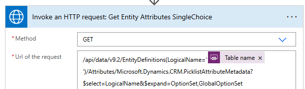
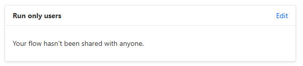
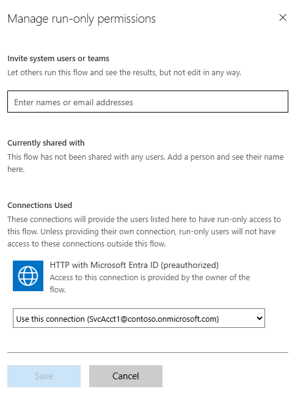
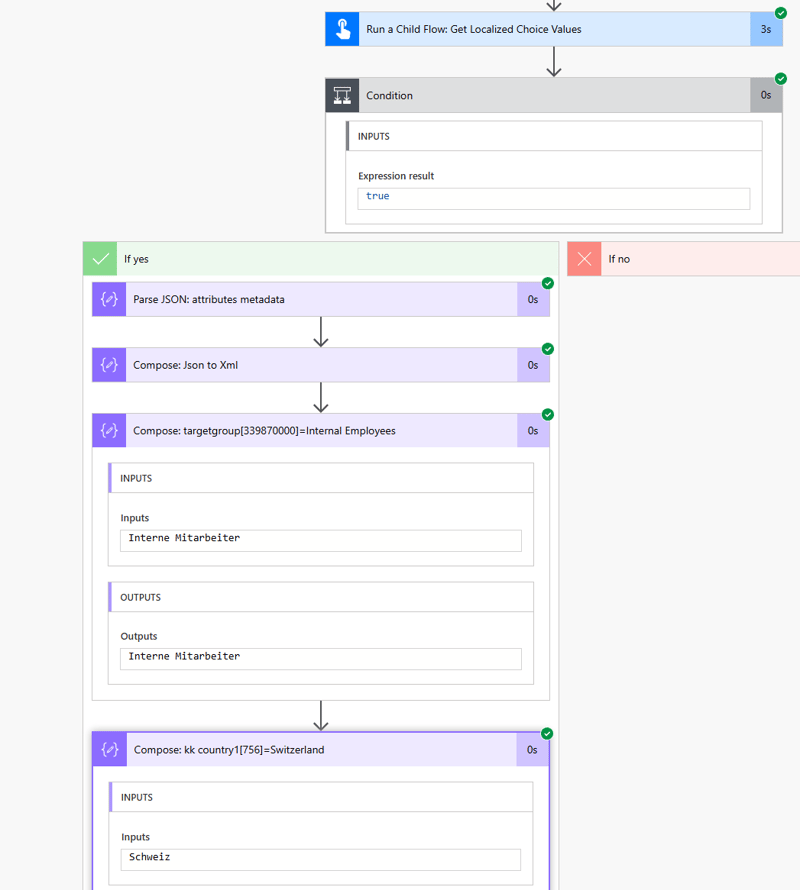

# Get Localized choice values for Dataverse record

Model-driven applications offer excellent support for building multilingual applications. Translations for UI elements and entity configurations can be easily provided using an Excel file, and the application adapts to the user's selected language through the Personalization settings (see [Languages tab options](https://learn.microsoft.com/en-us/power-apps/user/set-personal-options#languages-tab-option)).

When accessing record information through Power Automate, choice field values are presented as numerical codes rather than their display names. To obtain the choice display names in the user's language, these numerical values must be retrieved using tools like Power Automate.

## Get Localized choice values for record

The "Utils - Get Localized choice values for record" workflow retrieves definitions of choice and multi-choice fields in a Dataverse table, providing numerical values and labels for each choice in a specified language. It can be used either as a child workflow or as a standalone flow, and  accepts the following **parameters**:

| Parameter name | Description |
| - | - |
| `Table name`  | The  logical name of Dataverse entity, as defined in _Properties / Advanced options / Logical name_ |
| `lcid` | LCID code of a language, e.g. 1033 for English. Consider saving the language used by the user when a record is created. You may retrieve the language code using JavaScript: `Xrm.Utility.getGlobalContext().userSettings.languageId`   |
| `lcid fallback` | LCID code of language used as a fallback, in case the primary language is not detected. Use the default language of your environment. |

The definitions of choice columns are retrieved using "Invoke an HTTP request" action, calling the following endpoints:

- `https://org0api.crm17.dynamics.com/api/data/v9.2/EntityDefinitions(LogicalName='ENTITY_NAME')/Attributes/Microsoft.Dynamics.CRM.PicklistAttributeMetadata` request for single-choice, and
- `https://org0api.crm17.dynamics.com/api/data/v9.2/EntityDefinitions(LogicalName='ENTITY_NAME')/Attributes/Microsoft.Dynamics.CRM.MultiSelectPicklistAttributeMetadata` request for multi-choice fields.

> **Important**: The "[HTTP with Microsoft Entra ID (preauthorized)](https://learn.microsoft.com/en-us/connectors/webcontents/)" connector operates through a Microsoft 1st party trusted application. This application includes preauthorization for various Microsoft services and there is no need for administrators to explicitly grant consent for actions to be executed by the application on behalf of the user.
Microsoft also released a new version of the connector, the "[HTTP With Microsoft Entra ID](https://learn.microsoft.com/en-us/connectors/webcontentsv2/)", allowing administrators to grant discrete consent.
>
>The reason for using the  "HTTP with Microsoft Entra ID (preauthorized)" connector in this workflow is to ensure it works immediately once configured, and no additional action must be executed by the administrators.
>
>Update the workflow to use the "HTTP With Microsoft Entra ID" connector, if required.

The flow **returns the following values**:

| Name | Description |
| - | - |
| `Results` | JSON object with the following structure: 	`[{"LogicalName":"fieldName","Options":[{"Value":339870000,"Label":""}]}]` |
| `Error message` |	Empty, if success. Otherwise error message |
| `Success` | "True" or "False" |

## Solution components

The solution consists of:

- **Get Localized choice values** cloud flow,
- **Get Localized choice values - test** flow, used for evaluating the "Get Localized choice values" flow
- **2 global choice definitions**: `Countries` and `Target group`
- **HTTP with Microsoft Entra ID (preauthorized) ExternalCloudService-f5993** connection reference
- **Example** Dataverse table, with columns:
    - `Country 1` and `Country 2` referencing the `Countries` global choice
    - `Target group` referencing the `Target group` global choice
    - other columns created automatically

    

## Installation

1. To use the workflow, import either **managed or unmanaged solution** available under [Releases](https://github.com/kkazala/Power-Automate-Utils/releases). If you want to be able to edit the flow, choose **unmanaged**:

1. When importing a solution, you will need to provide a connection reference to your Power Platform Environment. Ensure that the connection is created using the URL of your Power Platform Environment.

    

    The value of "URL of the request"  does not include a host name. The request URL will be created by combining the URL specified in the referenced connection with the API endpoint defined in the "URL of the request" field.

    

1. After the solution is imported, configure the **Get Localized choice values** cloud flow, to be executed as a child flow. Configure the `run only` permissions, using the flow owner’s embedded connection:

   

    Click on **Edit** link and change the connection in the **Connections Used** section

    

1. Add a [service principal](https://learn.microsoft.com/en-us/power-automate/service-principal-support) as an additional owner to ensure business continuity.

## Using the flow

The **Get Localized choice values - test** flow provides an example on how to use the results returned by the **Get Localized choice values** flow.

1. To speed up the retrieval of the localized label, the results from the child flow are converted into an `XML` object, and an `xpath` expression is used to quickly extract the correct value.

1. The `sxPathQuery` variable is set to the following expression:
    `//arr[LogicalName="{fieldName}"]/Options[Value={fieldValue}]/Label`
1. The `{fieldName}` and `{fieldValue}` tokens are replaced by a field logical name and a numerical value, and used in the `xpath()` expression, e.g.

    `xpath(outputs('Compose:_Json_to_Xml'), concat('string(', replace(replace(variables('sxPathQuery'), '{fieldName}', 'kk_targetgroup'), '{fieldValue}', '339870000'), ')'))`

    , or

    `xpath(outputs('Compose:_Json_to_Xml'), concat('string(', replace(replace(variables('sxPathQuery'), '{fieldName}', 'kk_country1'), '{fieldValue}', '756'), ')'))`

1. When building real-life solution, define the `fieldValues` based on the record's properties.

    

