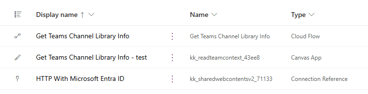

# Get SharePoint library info from Teams context

The "Get Teams Channel Library Info" flow may be used either directly from Canvas App added to MS Teams, or as a child flow.
It accepts two parameters: `teamsId` and `channelId`. Depending on the app type, use the following parameters:

|             | Embeded Canvas App   | Integrated Canvas App  |
| ----------- | -------------------- | ---------------------- |
| `teamId`    | `Param("teamId")`    | `Teams.ThisTeam.Id`    |
| `channelId` | `Param("channelId")` | `Teams.ThisChannel.Id` |

It returns the following information for a SharePoint location associated with the team and channel the Canvas App is added to:

| output value           |                                                                                                                                                                                  |
| ---------------------- | -------------------------------------------------------------------------------------------------------------------------------------------------------------------------------- |
| `folder_absolute_url`  | absolute url of a SPO library folder associated with the current teams channel, e.g. `https://contoso.sharepoint.com/sites/Orgteam/Shared%20Documents/Channel%201`               |
| `folder_display_name`  | display name of the folder; white spaces are not encoded, e.g. `Channel 1`                                                                                                       |
| `folder_drive_id`      | `driveItem Id` for the folder, e.g. `01CHDY72JWUJ42GM77UZEYSDW32BJ53M5G`. Can be used in MS Graph API [Get driveItem](https://learn.microsoft.com/en-us/graph/api/driveitem-get) |
| `folder_id`            | SPO list item id, e.g. `1`. Can be used in SharePoint REST API, or MS Graph API [Get listItem](https://learn.microsoft.com/en-us/graph/api/listitem-get)                         |
| `library_absolute_url` | absolute url of a SPO library, e.g. `https://contoso.sharepoint.com/sites/Orgteam/Shared%20Documents`                                                                            |
| `library_drive_id`     | `driveId` of the library, e.g. `b!Xj1cTAreVEyxW0CJgd9XEi27yh4bsARHiduN8u--GKCpBOoIL9i_Qpp1dqNUrygL`. Can be used in MS Graph API [Get Drive](https://learn.microsoft.com/en-us/graph/api/drive-get) |
| `library_id`           | Library id in a `guid` format, e.g. `08ea04a9-d82f-42bf-9a75-76a354af280b`.  Can be used in MS Graph API [Get metadata for a list](https://learn.microsoft.com/en-us/graph/api/list-get) |
| `library_name`         | display name of the library, e.g. `Shared Documents` |
| `library_title`        | internal name of the library, used in the URL, e.g. `Documents`|
| `site_id`              | SPO site id in a `guid` format, `4c5c3d5e-de0a-4c54-b15b-408981df5712`. Can be used in MS Graph API [Get a site resource](https://learn.microsoft.com/en-us/graph/api/site-get?view=graph-rest-1.0&tabs=http) |
| `site_title`           | display name of the sie, e.g. `Org team` |
| `site_url`             | absolute url of the SPO site, e.g. `https://contoso.sharepoint.com/sites/Orgteam` |
| `team_id`              | team's id in a `guid` format. Can be used in MS Graph API [Get team](https://learn.microsoft.com/en-us/graph/api/team-get), e.g. `6e440935-45b1-4bff-ac53-32ca9997e70a` |
| `tenant_name`          | the URL of the tenant's root site, e.g. `contoso.sharepoint.com`. Also used as a hostname when retrieving SPO site [using GUID](https://learn.microsoft.com/en-us/graph/api/site-get?view=graph-rest-1.0&tabs=http#example-1-get-a-site-using-the-site-id). |
| `web_id`               | id of the SPO web in a `guid` format, e.g. `1ecabb2d-b01b-4704-89db-8df2efbe18a0`. Used when retrieving SPO site [using GUID](https://learn.microsoft.com/en-us/graph/api/site-get?view=graph-rest-1.0&tabs=http#example-1-get-a-site-using-the-site-id). |

## Solution components

The solution consists of:

- **Get Teams Channel Library Info** Power Automate flow
- **Get Teams Channel Library Info - test** Canvas App. Add this app to a MS Teams channel to test the workflow
- **HTTP With Microsoft Entra ID** connection reference.

## Installation

1. To use the workflow, import either **managed or unmanaged solution** available under [Releases](https://github.com/kkazala/Power-Automate-Utils/releases). If you want to be able to edit the flow, choose **unmanaged**.

1. During the import process, update the connection reference.

1. After the solution is imported, configure the **Get Teams Channel Library Info"** cloud flow, to be executed as a child flow **if necessary**. Configure the `run only` permissions, using the flow owner’s embedded connection:

   

1. Add a [service principal](https://learn.microsoft.com/en-us/power-automate/service-principal-support) as an additional owner to ensure business continuity.

## Workflow contents

See [Get SharePoint library info from Teams context](https://dev.to/kkazala/get-sharepoint-library-info-from-teams-context-1cbj) for the description of the workflow.

> ⚠️ Important
>
> You are now installing a workflow from an unknown source in the internet. I appreciate your trust and I'm happy if you find this workflow useful.
> The least you can do to ensure you are not installing malicious flow that will leak data from your company, is to review it. Always check if there are any actions that might send information to an external endpoint.