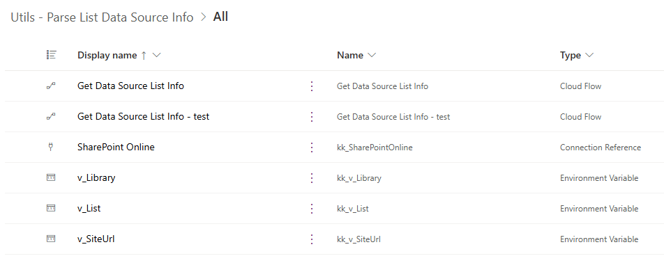
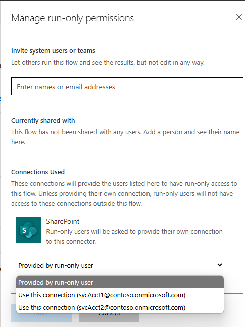
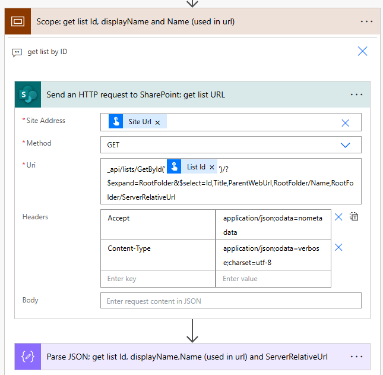
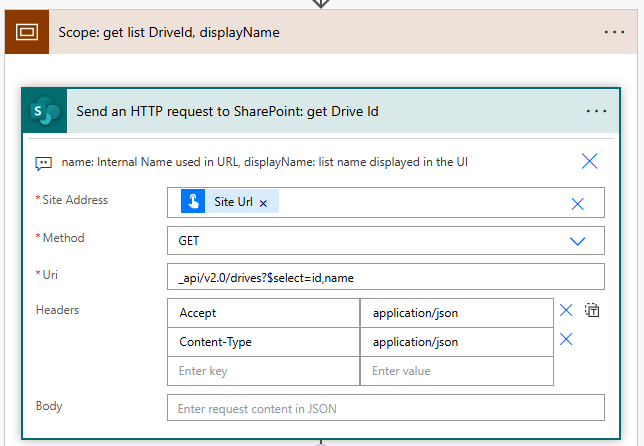
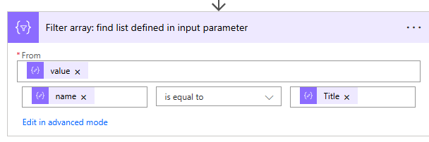

# Data Source Environment Variables in Power Automate actions

The "Get Data Source List Info" flow is designed to be executed as a child flow and accepts two parameters: the `site URL` and `library/list Id`, as provided by the environment variables.

**Version 1.0.1** of the flow returns the following information:

| parameter name | description | example |
|-|-|-|
| `host_name` | The URL of the root SharePoint site | `contoso.sharepoint.com` |
| `site_url` | The URL of the current SharePoint site, as defined in the `site URL` parameter.  | `https://contoso.sharepoint.com/sites/XYZ` |
| `site_title` | Title of the current SPO site | `Project XYZ` |
| `site_id` | The `id` of the current SPO site in a `guid` format. | `xxxxxxxx-xxxx-xxxx-xxxx-xxxxxxxxxxxx` |
| `web_id` | The `id` of the current SPO web object in a `guid` format. | `yyyyyyyy-yyyy-yyyy-yyyy-yyyyyyyyyyyy` |
| `list_absolute_url` | The full URL of the list. | `https://contoso.sharepoint.com/sites/xyz/Archives` or `https://contoso.sharepoint.com/sites/xyz/Lists/Issue tracker` |
| `list_name` | The `RootFolder`. Used in the URL, is generated automatically and cannot be changed by users. It can be changed with PowerShell.| `Archive` |
| `list_title` | The title of the list. This property can be changed by the user. | `The Archive Library` |
| `list_id` | The value provided as `List Id `parameter | `zzzzzzzz-zzzz-zzzz-zzzz-zzzzzzzzzzzz` |
| `list_drive_id` | Used by Graph API when referencing libraries. Only for document libraries. | `b!S3SdNSBmTUGa4v5ffh_rslLJssoXH4xEuShkEO-uxKg9bblUMeoaTbQC5t69DJ-x` |
| `error_message` | The error message if any of the actions failed, or empty string. | `{"Error":"Send_an_HTTP_request_to_SharePoint:_get_Site_with_MS_Graph:[...]},{"Error":"Send_an_HTTP_request_to_SharePoint:_get_list_URL: \\"401 UNAUTHORIZED[...]\\""}`   |
| `success` | | `True` or `False` |

## Solution components

The solution consists of:

-   **Get Data Source List Info** cloud flow,
-   **Get Data Source List Info - test** flow, used for evaluating the "Get Data Source List Info" flow
-   **3 environment variables**: v_SiteUrl, v_List and v_Library, used in the **test** flow
-   **SharePoint Online** connection reference

## Installation

1. To use the workflow, import either **managed or unmanaged solution** available under [Releases](https://github.com/kkazala/Power-Automate-Utils/releases). If you want to be able to edit the flow, choose **unmanaged**:

1. During the import process, update the connection references and environment variables.

1. After the solution is imported, configure the **Get Data Source List Info** cloud flow, to be executed as a child flow. Configure the `run only` permissions, using the flow owner’s embedded connection:

   

   Click on **Edit** link and change the connection in the **Connections Used** section

   

1. Add a [service principal](https://learn.microsoft.com/en-us/power-automate/service-principal-support) as an additional owner to ensure business continuity.

## Workflow contents

> ⚠️ Important
>
> You are now installing a workflow from an unknown source in the internet. I appreciate your trust and I'm happy if you find this workflow useful.
> The least you can do to ensure you are not installing malicious flow that will leak data from your company, is to review it. Always check if there are any actions that might send information to an external endpoint.

### Scope: get list Id, displayName and Name (used in url)

This action is using `GET` method, which means it's reading information from your SharePoint site.

It retrieves list information for the list defined as a parameter, and and retrieves parameters that are returned by the flow.

### Send an HTTP request to SharePoint: get Drive Id

This action is also only reading (`GET` method) data from your SharePoint site.
It is using [\_api/v2.0/drive](https://learn.microsoft.com/en-us/graph/api/drive-list?view=graph-rest-1.0&tabs=http) api to list availabled drives.

This api doesn't support filtering, so after retrieving all available drives (libraries) the flow filters results to find the requested library:

## Additional resources

[Helpful tips for using Child Flows](https://www.microsoft.com/en-us/power-platform/blog/power-automate/helpful-tips-for-using-child-flows/?msockid=3f7882d233bd676f193e961932e66616)

[Support for service principal owned flows](https://learn.microsoft.com/en-us/power-automate/service-principal-support)

[Service principal application users can own and run flows](https://learn.microsoft.com/en-us/power-platform/release-plan/2023wave1/power-automate/enable-flows-that-are-owned-service-principals)
