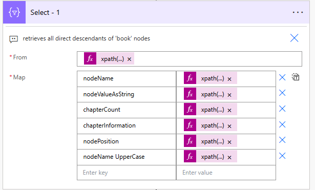
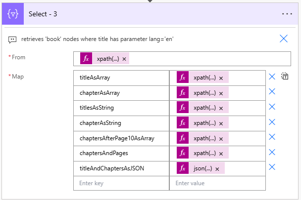

# xPath 101

> This Power Automate Workflow includes examples of xPath expressions, as described in See [XPath in Power Automate - cheatsheet](https://dev.to/kkazala/xpath-in-power-automate-d37)

While Power Automate documentation does not explicitly state the XPath version supported by the  [xPath()](https://learn.microsoft.com/en-us/azure/logic-apps/workflow-definition-language-functions-reference#xpath) function, there are sources that confirm Power Automate supports **XPath 1.0**. Sources like... community discussions, or failed tests when using XPath 2.0 😉

For the XPath reference, including supported syntax and functions, see [XPath Reference](https://learn.microsoft.com/en-us/previous-versions/dotnet/netframework-3.5/ms256115(v=vs.90))


## Solution components

The solution consists of:

-   **xPath 101** cloud flow,


## Installation

1. To use the workflow, import either **managed or unmanaged solution** available under [Releases](https://github.com/kkazala/Power-Automate-Utils/releases). If you want to be able to edit the flow, choose **unmanaged**.

## Workflow contents

Most of the examples I found for using `xpath` in Power Automate cover the very basic example of the [bookstore](https://www.w3schools.com/xml/xpath_nodes.asp).

Let's extend the example with additional books and chapter information.

```xml
<?xml version="1.0" encoding="UTF-8"?>
<bookstore>
    <book>
        <title lang="en">Harry Potter</title>
        <author>J K. Rowling</author>
        <year>2005</year>
        <price currency="USD">29.99</price>
        <info>
            <chapters>
                <chapter>
                    <name>The Boy Who Lived</name>
                    <page>1</page>
                    <description>Introduction to Harry Potter's early life.</description>
                </chapter>
                <chapter>
                    <name>The Vanishing Glass</name>
                    <page>15</page>
                    <description>Harry's encounter with a snake at the zoo.</description>
                </chapter>
            </chapters>
        </info>
    </book>
    <book>
        <title lang="de">Der Hobbit</title>
        <author>J.R.R. Tolkien</author>
        <year>1937</year>
        <price currency="USD">19.99</price>
        <info>
            <chapters>
                <chapter lcid="1031">
                    <name>Eine unerwartete Party</name>
                    <page>1</page>
                    <description>Bilbo Beutlin trifft die Zwerge.</description>
                </chapter>
                <chapter lcid="1031">
                    <name>Gebratenes Hammelfleisch</name>
                    <page>35</page>
                    <description>Die Zwerge begegnen Trollen.</description>
                </chapter>
            </chapters>
        </info>
    </book>
    <book>
        <title lang="en">1984</title>
        <author>George Orwell</author>
        <year>1949</year>
        <price currency="USD">14.99</price>
        <info>
            <chapters>
                <chapter>
                    <name>The Principles of Newspeak</name>
                    <page>1</page>
                    <description>Introduction to the language of Oceania.</description>
                </chapter>
                <chapter>
                    <name>War is Peace</name>
                    <page>50</page>
                    <description>Explanation of the Party's slogans.</description>
                </chapter>
            </chapters>
        </info>
    </book>
</bookstore>
```

> **Important!** Remember to parse the string to **xml object** using `xml()` function.


## Selecting Nodes

|xPath expression| <div style="width:500px">Result </div>|
|-|-|
| `xpath(variables('oBookstoreXml'),'//book/*')` | all direct descendants of 'book' nodes |
| `xpath(variables('oBookstoreXml'),'//book/*[@*]')` | all direct descendants of 'book' nodes, which have at least one attribute of any kind |
| `xpath(variables('oBookstoreXml'),'//book[title[@lang="en"]]')` | all  'book' nodes where title has parameter lang='en |
| `xpath(variables('oBookstoreXml'),'//book/*[self::title or self::author]')` | all title and author elements of all book nodes <sup>*</sup> |

> <sup>*</sup> The `|` operator, used for for selecting several paths, is not supported in xPath 1.0.

## XPath functions

I'm using **Select** action in all the examples.

For a list of supported XPath functions, see [XPath Functions](https://learn.microsoft.com/en-us/previous-versions/dotnet/netframework-3.5/ms256138(v=vs.90)).

### Example 1

Select all direct descendants of 'book' nodes and read nodes information. This example used the following XPath functions: `name()`, `string()`, `count()`, `concat()`, `position()`.



**From**: `xpath(variables('oBookstoreXml'),'//book/*')`
**Map**:

| value | expression |
|-|-|
| nodeName | `xpath(item(), 'name(/*)')` |
| nodeValueAsString | `xpath(item(), 'string(/*)')` |
| chapterCount | `xpath(item(), 'count(//chapter)')` |
| chapterInformation | `xpath(item(), 'concat("This node has ",count(//chapter), " chapter child nodes")')` |
| nodePosition | `xpath(item(), 'position()')` |

#### Results

```json
[
  {
    "nodeName": "title",
    "nodeValueAsString": "Harry Potter",
    "chapterCount": 0,
    "chapterInformation": "This node has 0 chapter child nodes",
    "nodePosition": 1
  },
  {
    "nodeName": "author",
    "nodeValueAsString": "J K. Rowling",
    "chapterCount": 0,
    "chapterInformation": "This node has 0 chapter child nodes",
    "nodePosition": 1
  },
  //....
  {
    "nodeName": "info",
    "nodeValueAsString": "\n  \n    \n      The Boy Who Lived\n      1\n      Introduction to Harry Potter's early life.\n    \n    \n      The Vanishing Glass\n      15\n      Harry's encounter with a snake at the zoo.\n    \n  \n",
    "chapterCount": 2,
    "chapterInformation": "This node has 2 chapter child nodes",
    "nodePosition": 1
  },
  //...
]
```

The `position()` function returns `1` for each node, because the `xpath` expressions in the `Map` section only have access to the chunk returned by the `From` query.

Some string functions, .e.g. `upper-case()`, would throw an error because they are not supported in XPath 1.0.

### Example 2

Select all direct descendants of 'book' nodes, which have at least one attribute of any kind. This example focuses on working with attributes: filtering based on their presence and accessing their values


**From**: `xpath(variables('oBookstoreXml'),'//book/*[@*]')`
**Map**:

| value | expression |
|-|-|
| nodeName | `xpath(item(), 'name(/*)')` |
| attributeLang | `xpath(item(), '//@lang')` |
| attributeLangValue | `xpath(item(), 'string(//@lang)')` |
| anyAttribute | `xpath(item(), '//@*')` |

#### Results

```json
[
  {
    "nodeName": "title",
    "attributeLang": [
      "lang=\"en\""
    ],
    "attributeLangValue": "en",
    "anyAttribute": [
      "lang=\"en\""
    ]
  },
  //...
]
```

### Example 3

Select all 'book' nodes where title has parameter lang='en', perform more complex transformations to retrieve results as string, array or a JSON object.




**From**: `xpath(variables('oBookstoreXml'),'//book/*[@*]')`
**Map**:

| value | expression |
|-|-|
| titleAsArray | `xpath(item(), '//title/text()')` |
| chapterAsArray | `xpath(item(), '//chapter/name/text()')` |
| titlesAsString | `xpath(item(), 'string(//title)')` |
| chapterAsString | `xpath(item(), 'string(//chapter/name)')` |
| chaptersAfterPage10AsArray | `xpath(item(), '//chapter[page>10]/name/text()')` |
| chaptersAndPages | `xpath(item(), '//chapter/*[self::name or self::page]/text()')` |
| titleAndChaptersAsJSON | `json(concat('{"title":"',xpath(item(), string(//title)'),'","chapters":',xpath(item(), '//chapter/name/text()'),'}'))` |

#### Results

```json
[
  {
    "titleAsArray": [
      "Harry Potter"
    ],
    "chapterAsArray": [
      "The Boy Who Lived",
      "The Vanishing Glass"
    ],
    "titlesAsString": "Harry Potter",
    "chapterAsString": "The Boy Who Lived",
    "chaptersAfterPage10AsArray": [
      "The Vanishing Glass"
    ],
    "chaptersAndPages": [
      "The Boy Who Lived",
      "1",
      "The Vanishing Glass",
      "15"
    ],
    "titleAndChaptersAsJSON": {
      "title": "Harry Potter",
      "chapters": [
        "The Boy Who Lived",
        "The Vanishing Glass"
      ]
    }
  },
  //...
]
```

`string()` function converts nodes to strings, while `/text()` is a node test that selects text nodes directly.

The `xpath(item(), '//chapter/*[self::name or self::page]/text()')` expression selects multiple paths in a way supported by XPath 1.0.

The xPath expression used by **titleAndChaptersAsJSON** is a bit more involved and is using both, Power Automate and XPath functions.

```javascript
json(
 concat(
  '{"title":"',
     xpath(item(), 'string(//title)'),
   '","chapters":',
     xpath(item(), '//chapter/name/text()'),
'}')
)
```
The `json()` function allows us to return an object. the `concat()` function generates string representing the object. Both of these functions are Power Automate functions.

The value returned as `title` is retrieved using `string(//title)` XPath expression ensuring that the returned value is a `string`.

The chapters list is retrieved using `//chapter/name/text()` XPath expression, returning a list of string values.

#### What didn't work.

The `xpath(item(),'//book/concat(title/text(), " - ", author/text())')` expression would be useful in transforming XML to an object with a simplified structure. Unfortunately, XPath 1.0 does not support the `concat` function directly within the path expression.

## Beyond XML

`xpath()` is an incredibly useful and powerful function, that can speed up content transformations. And its application goes beyond to parsing XML files. Whenever the `Select` action is not enough, and I want to avoid using `Apply to each`, I transform JSON to XML and use `xPath()` for more power 🚀🚀🚀


**Value**: `xml(json(concat('{ "root": { "arr": ',variables('jsonResponse'), '}}')))`

> If you are unsure when to use `Select` vs `Apply to each` action in your workflows, see [Streamlining your Power Automate Flows with the Select Action](https://medium.com/@greenlightza/streamlining-your-power-automate-flows-with-the-select-action-39036dea6a57).

YOu may download the solution with Power Automate workflow including the above examples from [Power-Automate xPath 101](https://github.com/kkazala/Power-Automate-Utils/releases) GitHub repo.

